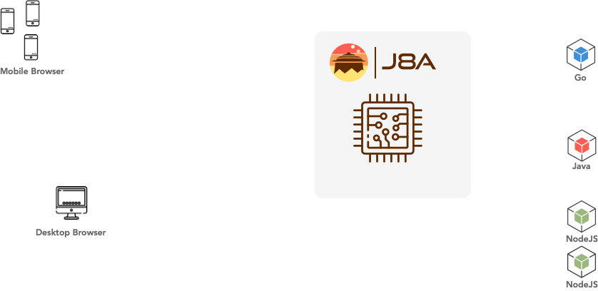

[](https://circleci.com/gh/simonmittag/j8a)
[](https://github.com/simonmittag/j8a/actions)
[](https://github.com/simonmittag/j8a/pulls?q=is%3Aopen+is%3Apr)
[](https://github.com/simonmittag/j8a/issues)
[](https://img.shields.io/github/commit-activity/m/simonmittag/j8a)  
[](https://goreportcard.com/report/github.com/simonmittag/j8a)
[](https://codeclimate.com/github/simonmittag/jabba/maintainability)
[](https://codeclimate.com/github/simonmittag/jabba/code)
[](https://www.ssllabs.com/ssltest/analyze.html?d=j8a.io)
[](https://img.shields.io/github/go-mod/go-version/simonmittag/j8a)
[](https://opensource.org/licenses/Apache-2.0)
[](https://hub.docker.com/repository/docker/simonmittag/j8a)
[](https://hub.docker.com/repository/docker/simonmittag/j8a)

## CVEs
🛡️ J8a has [zero](https://www.cvedetails.com/google-search-results.php?q=j8a&sa=Search) reported CVEs as of 02/06/2023. 
If you are a security researcher, the project team would like to [hear from you](https://github.com/simonmittag/j8a/issues).

## What's new?

### v1.0.1 (26/05/2023)
* can now validate config & files with cli option `-o`
* added cli flags `-h` for usage and `-v` for version

### v1.0.0 (07/05/2023)
* support for virtual host based routing inc subdomains.
* timeZone and logLevel are now options in config.yml as opposed to env variables.
* re-introduced support for HTTP PATCH method.
* OPTIONS requests to '*' now list legal server HTTP methods
* update to go 1.20, and multiple dependency updates

# What is j8a?

[j8a [ dʒʌbbʌ ]](https://j8a.io) is a modern **TLS 1.3 reverse proxy server** designed as a lightweight API gateway for
REST APIs. 



## Features

* Fast! 5k POST req/s traffic.
* Secure. TLS1.2, TLS/1.3 termination w/ [A+ SSLLabs rating](https://www.ssllabs.com/ssltest/analyze.html?d=j8a.io).
* Zero downtime. Auto-renew certs using ACME [RFC 8555](https://tools.ietf.org/html/rfc8555).
* Observable. API request tracing w/ correlation ID for upstream microservices.
* APM. CPU, memory logging built-in. Daily TLS health and validity check for your full certificate chain.
* JWT token validation with full JWK(S) support for [RFC 7519](https://tools.ietf.org/html/rfc7519).
* HTTP/1.1 and HTTP/2 support w/ upstream <> downstream protocol translation.
* Websocket Support for [RFC 6455](https://datatracker.ietf.org/doc/html/rfc6455)
* [Docker](https://hub.docker.com/repository/docker/simonmittag/j8a) native

## Up and running

### Docker
```
docker pull simonmittag/j8a &&
  docker run -e J8ACFG_YML -p443:443 simonmittag/j8a
```

### Homebrew
```bash
brew tap simonmittag/cli && 
  brew install j8a && 
  j8a
```

### Golang
```bash
go install github.com/simonmittag/j8a/cmd/j8a &&
  j8a
```

## Usage
J8a runs from the cli. The process will attempt to load its configuration from the environment 
variable `J8ACFG_YML`, a specified config file, or the default config file `j8acfg.yml` (in that order). 
You can validate the config using the `-o` flag without actually starting the server, which 
is useful for ci/cd pipelines. In validate mode, the process successfully exits with `0`, or `-1` in case of failure.

### Commandline Options

```bash
λ j8a -h
j8a[v1.0.1] Goodde da lodia!
Usage: j8a [-c] [-o] | [-v] | [-h]
  -c string
        config file location (default "j8acfg.yml").
  -h    print usage instructions.
  -o    validate config file, then exit.
  -v    print version.
```

### Examples

Validate Server Configuration supplied as `myconfig.yml`
```bash
λ j8a -c myconfig.yml -o
6:25PM INF hostName determined hostName=MacBook-Pro-16.local
6:25PM INF version determined version=v1.0.1
6:25PM INF srvID determined srvID=c91cda8c
...
```

Start Server With Configuration supplied as `myconfig.yml`
```bash
λ j8a -c myconfig.yml 
6:25PM INF hostName determined hostName=MacBook-Pro-16.local
6:25PM INF version determined version=v1.0.1
6:25PM INF srvID determined srvID=c91cda8c
...
```

Start Server With Configuration supplied via `J8ACFG_YML`
```bash
J8ACFG_YML="---
            timeZone: UTC
            logLevel: INFO
            routes:
              - path: "/todos"
                resource: jsonplaceholder
            resources:
              jsonplaceholder:
                - url:
                    scheme: https
                    host: jsonplaceholder.typicode.com
                    port: 443" j8a
```

## Contributions

The j8a team welcomes all [contributors](https://github.com/simonmittag/j8a/blob/master/CONTRIBUTING.md). Everyone
interacting with the project's codebase, issue trackers, chat rooms and mailing lists is expected to follow
the [code of conduct](https://github.com/simonmittag/j8a/blob/master/CODE_OF_CONDUCT.md)
